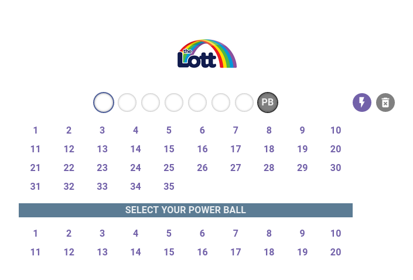
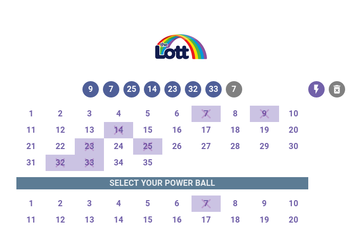
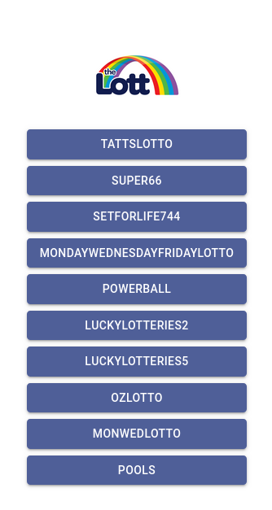
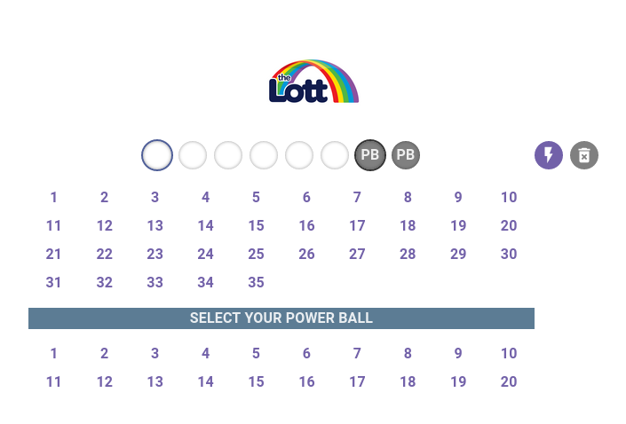
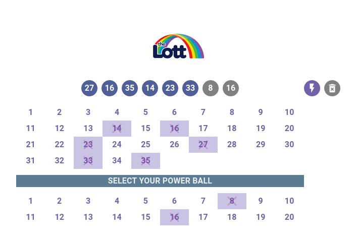

# The Lottery Group - Coding Challenge 

## Overview
This project is a web application designed for theLott.com coding test. The application allows users to autofill the previous week's Powerball draw numbers into a ticket layout and clear the numbers from the ticket.

## Prerequisites
To run the application you require the following (should be fine with the LTS for all these below):
- `npm`
- `node`
- `docker-compose` (Optional if you prefer running this in a container)

## Getting started
You can run this via your local machine
1. Run `cp .env.example .env`
2. Run `npm install`
3. Run `npm run dev`
4. Visit http://localhost:3003/lotto/

Alternatively, you can run this via `docker-compose`
1. Run `cp .env.example .env`
2. Run `cp docker-compose.example.yml docker-compose.yml`
3. Run `npm install`
4. Run `docker compose up`
5. Visit http://localhost:3003/lotto/

## Live demo
You can see a live demo here https://beeek3r.github.io/lotto/

## Running tests
You can run unit/component tests by running `npm run test` (inside or outside the container)

## Screenshots

## Extra
Created the main component in a generic manner for different draws. If you update the call in `Home.tsx` you can view addtional draws.

